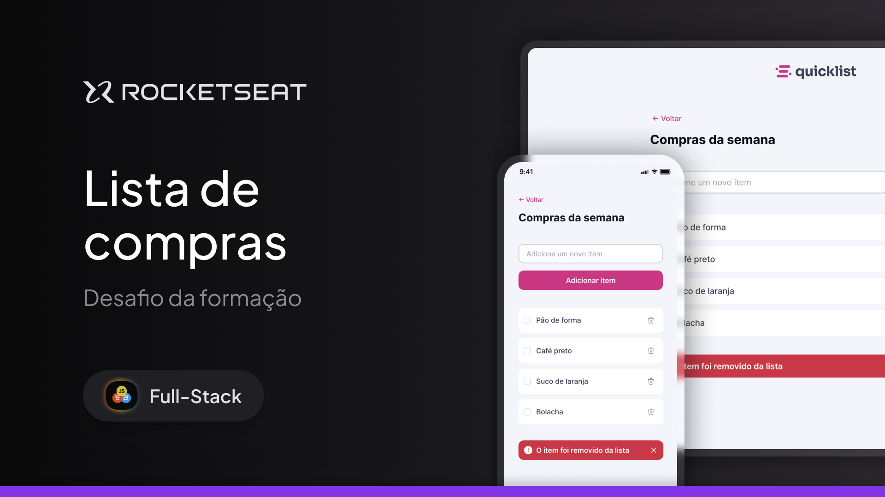

# Formação Full-Stack: Lista de Compras

Acesse em: <a href="https://limacaiquelg.github.io/fullstack-quicklist/">https://limacaiquelg.github.io/fullstack-quicklist/</a>

 

Este projeto consiste em uma página web desenvolvida utilizando HTML, CSS e Javascript. Esta aplicação é uma lista de compras em que é possível adicionar itens e removê-los da lista.
 

Os seguintes tópicos são trabalhados nesta aplicação: 

<ul>
  <li>Manipulação do DOM</li>
  <li>Manipulação de strings em Javascript</li>
  <li>Funções em Javascript</li>
  <li>Eventos em Javascript</li>
  <li>Expressões regulares</li>
</ul>

Este projeto faz parte da formação Full-Stack da <a href="https://www.rocketseat.com.br">Rocketseat</a>.
